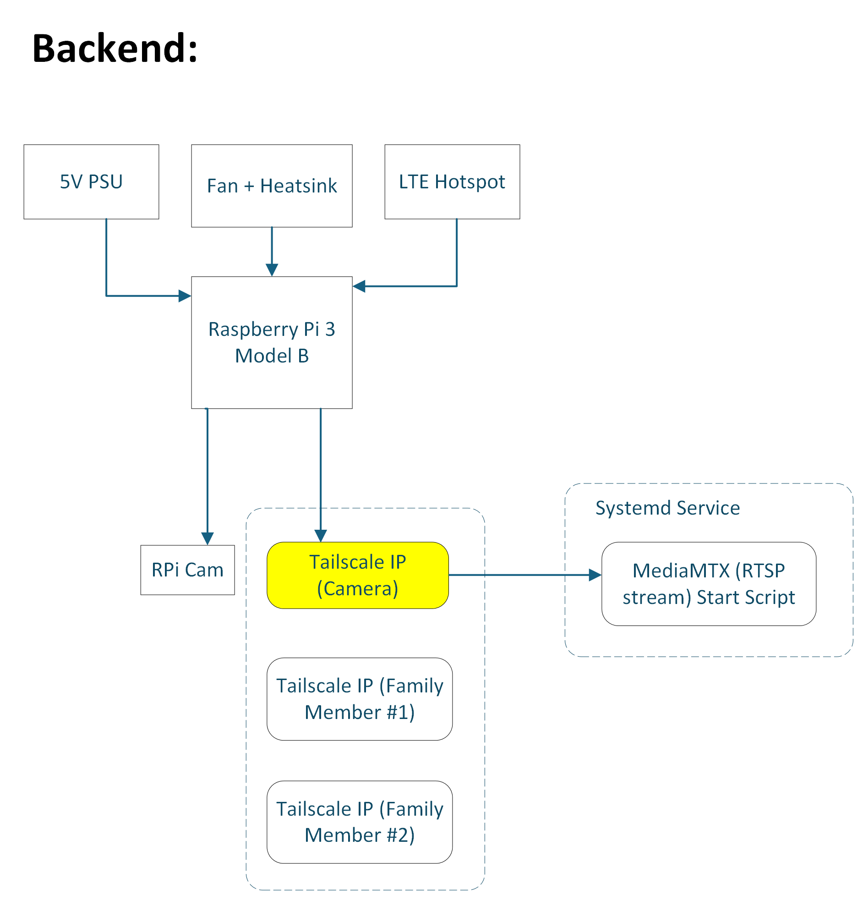
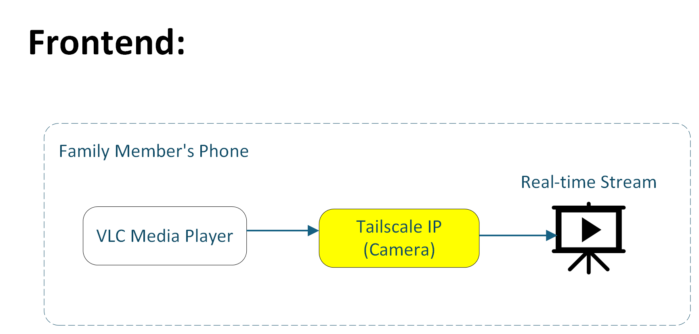

# Low-Cost IoT Camera
## Purpose
I wanted to build an affordable remote camera for home use when I'm away. Using spare parts, open source software and a hotspot, this solution bypasses proprietary applications and subscriptions services at a fraction of the cost.

### Bill of Materials
* Raspberry Pi Model 3B
* Raspberry Pi Camera V1.3 (5MP)
* Raspberry Pi Enclosure
* Custom Pi Cover (3D Printed)
* Fan + Heatsink
* TCL LINKPORT IK511
* 5V PSU

### Backend
The Raspberry Pi acts as the local camera host and Tailscale VPN access point for approved users to view the camera feed. A fan and/or heatsink is highly recommended for heat dissipation as the camera stream will remain on when the Pi is powered. MediaMTX is a lightweight media server that broadcasts the camera stream over the Pi's Tailscale IP. To minimize power consumption and form factor, the system runs headless and starts the MediaMTX script on boot via a systemd service file.

### Frontend
To access the camera stream, users that have been invited to the Tailscale VPN are able to enter the Pi's IP into a network media viewer such as VLC.

### Hardware
Using a stock Raspberry Pi enclosure as a base, I designed a 3D printable cover that holds both the hotspot and camera. The cover has a small slit for the camera's FPC cable to connect the Pi and mounting holes for the protective camera shroud.
